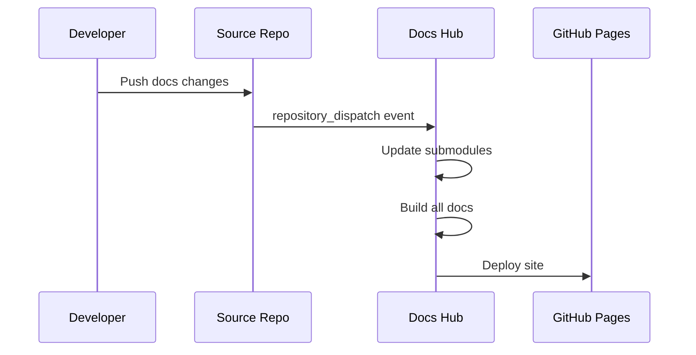

# Documentation Hub

Central documentation portal that aggregates multiple project documentation sites using mkdocs-multirepo.

## Architecture

This repository serves as the single source for building and publishing documentation to GitHub Pages. It:

1. **Aggregates** multiple documentation repositories using git submodules
2. **Builds** each project's MkDocs documentation separately
3. **Generates** a unified landing page with links to all projects
4. **Auto-updates** when any source repository pushes documentation changes

## Structure

```
docs-hub/
├── config.yml                    # mkdocs-multirepo configuration
├── index.tpl                     # Landing page template
├── styles.css                    # Custom styles for landing page
├── requirements.txt              # Python dependencies
├── assets/                       # Shared assets (logos, images)
├── src/                          # Generated: cloned repos (gitignored)
├── site/                         # Generated: built site (gitignored)
└── .github/
    └── workflows/
        ├── pages.yml             # Build and deploy workflow
        └── notify-docs-hub.example.yml  # Example for source repos
```

## Setup

### 1. Configure GitHub Pages

1. Go to repository Settings → Pages
2. Source: GitHub Actions
3. The workflow will deploy automatically

### 2. Add Documentation Repositories

Edit `config.yml` and add your repositories:

```yaml
repos:
  - name: your-project
    title: Your Project Name
    url: https://github.com/yourusername/your-project.git
    branch: main
    element_id: public-projects
```

### 3. Configure Source Repositories

For each repository you want to include:

1. Ensure it has a `docs/` directory and `mkdocs.yml` or `mkdocs.yaml`
2. Copy `.github/workflows/notify-docs-hub.example.yml` to that repo as `.github/workflows/notify-docs-hub.yml`
3. Create a fine-grained Personal Access Token (PAT) with:
   - Repository access: Only select repositories (choose docs-hub)
   - Permissions: Contents (read), Workflows (read and write)
4. Add the PAT as a secret named `DOCS_HUB_TOKEN` in the source repository

### 4. Private Repositories (Optional)

For private documentation repositories:

1. Create another fine-grained PAT with:
   - Repository access: Only select repositories (choose your private repos)
   - Permissions: Contents (read)
2. Add it as `GH_READ_TOKEN` secret in the docs-hub repository
3. Uncomment the private repo entries in `config.yml`

## How It Works

### Automatic Updates



### Build Process

1. **Trigger**: Push to main, repository_dispatch, or manual workflow_dispatch
2. **Update**: `mkdocs-multirepo --update` clones/updates all repos as submodules
3. **Build**: `mkdocs-multirepo --build` builds each project separately
4. **Landing**: Generates `index.html` from `index.tpl` with links to all projects
5. **Deploy**: Uploads to GitHub Pages

## Local Development

```bash
# Install dependencies
pip install -r requirements.txt

# Update and build
mkdocs-multirepo --update
mkdocs-multirepo --build

# Serve locally (if you want to preview, though mkdocs-multirepo doesn't have serve)
cd site && python -m http.server 8000
```

## Customization

### Landing Page

Edit `index.tpl` to change the layout and structure of the landing page.

### Styling

Edit `styles.css` to customize colors, fonts, and visual design.

### Sections

Group projects into different sections by using different `element_id` values:

```yaml
repos:
  - name: proj-a
    element_id: public-projects
  - name: blog
    element_id: blog
```

Then add corresponding sections in `index.tpl`:

```html
<section id="public-projects"></section>
<section id="blog"></section>
```

## Dependencies Management

All source repositories should use compatible MkDocs plugins. The `requirements.txt` in docs-hub includes common plugins:

- `mkdocs-material`: Material theme
- `pymdown-extensions`: Enhanced markdown
- `mkdocs-mermaid2-plugin`: Diagram support

If a source repo needs additional plugins, add them to `requirements.txt`.

## Troubleshooting

### Build Fails with Missing Plugin

Add the required plugin to `requirements.txt` and push to trigger a rebuild.

### Private Repo Not Accessible

Verify `GH_READ_TOKEN` secret has correct permissions and hasn't expired.

### Dispatch Not Triggering Build

Check that:
- `DOCS_HUB_TOKEN` secret exists in source repo
- Token has workflow write permissions
- Repository name in notify workflow matches docs-hub

### Submodule Update Fails

Check that the branch specified in `config.yml` exists and is accessible.

## References

- [mkdocs-multirepo](https://github.com/jdoiro3/mkdocs-multirepo)
- [GitHub Pages with Actions](https://docs.github.com/en/pages/getting-started-with-github-pages/configuring-a-publishing-source-for-your-github-pages-site#publishing-with-a-custom-github-actions-workflow)
- [repository_dispatch](https://docs.github.com/en/actions/using-workflows/events-that-trigger-workflows#repository_dispatch)
